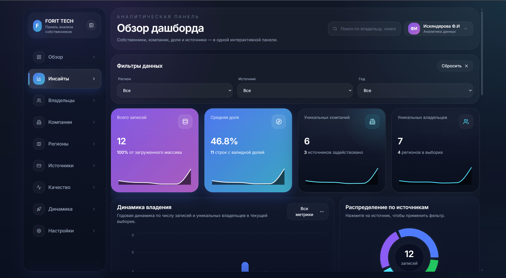
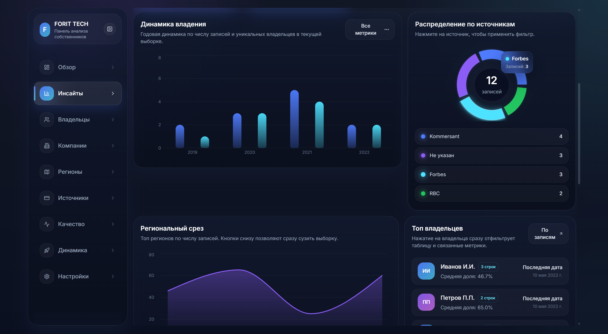
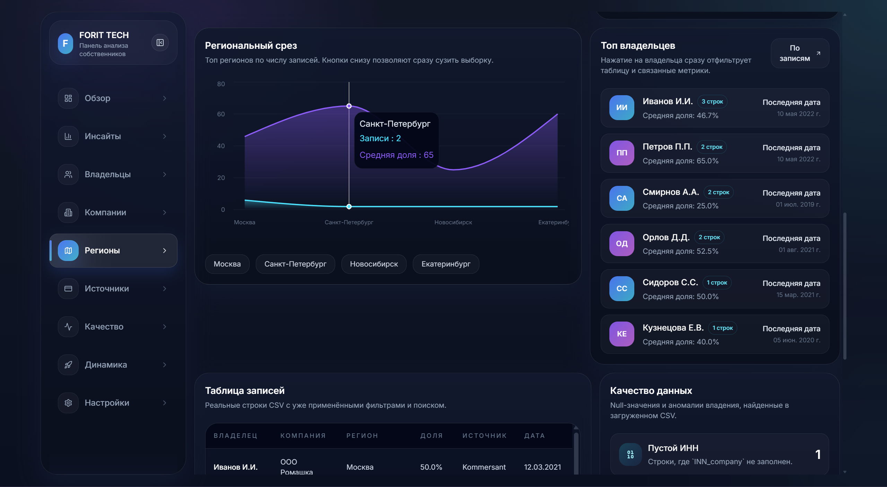
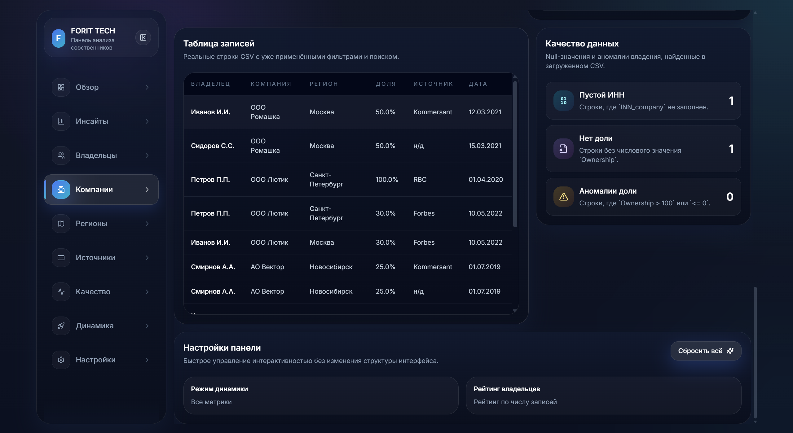
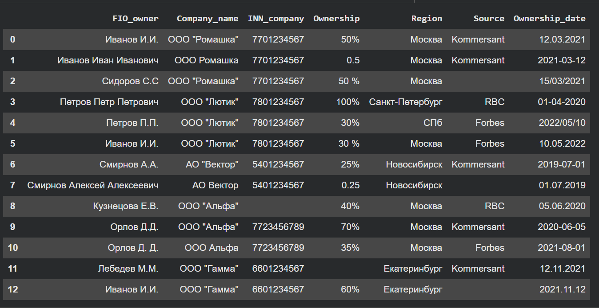
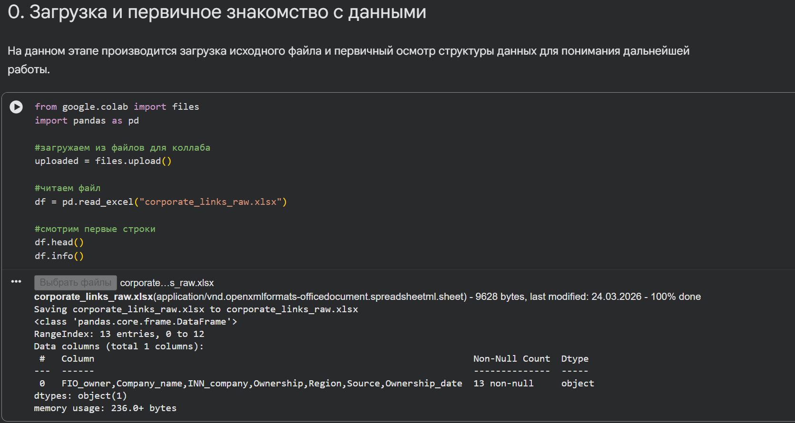
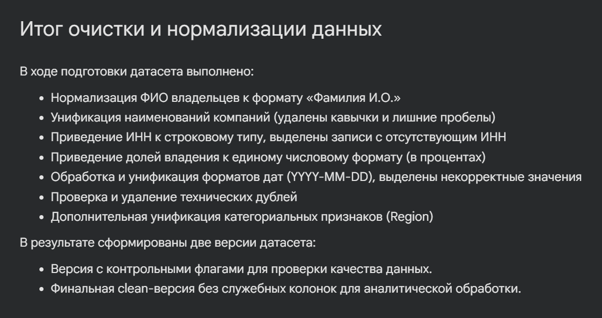
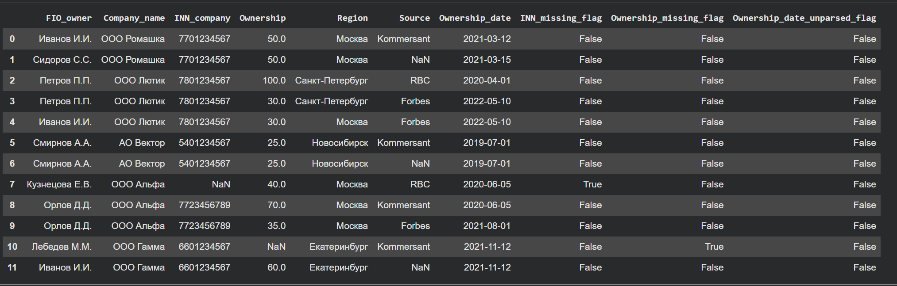
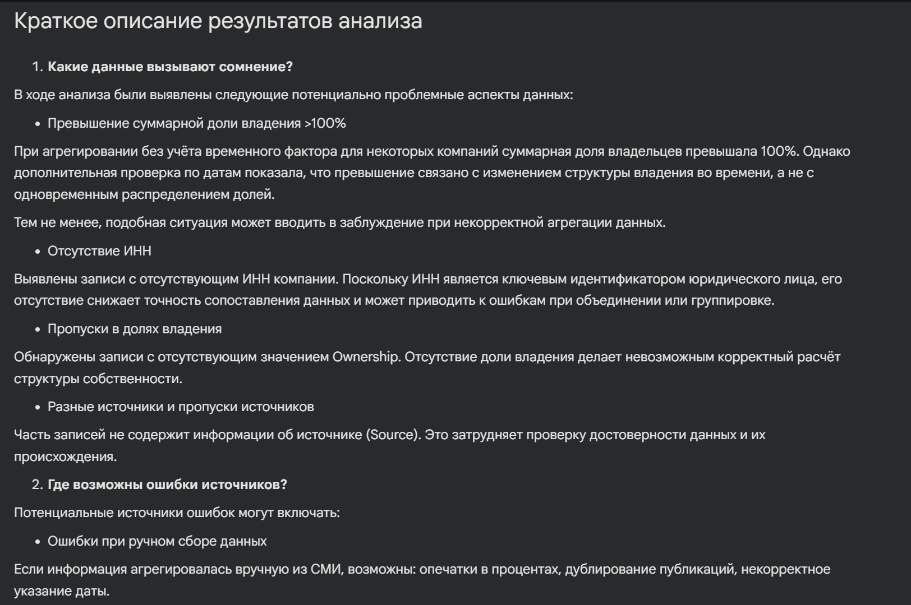

# FORIT TECH — Панель анализа собственников

Интерактивный аналитический продукт для работы с данными о владельцах, компаниях, долях и источниках.  
Здесь есть две части: подготовка данных в notebook и продуктовый дашборд, который превращает очищенный CSV в понятную управленческую аналитику.

## 🚀 Кратко о проекте

Что это по сути:

- не просто витрина графиков, а компактный data product;
- не просто CSV, а пайплайн от сырого файла до готовой аналитики;
- не просто интерфейс, а инструмент для быстрого ответа на вопросы: кто владеет, где сосредоточены записи, какие источники доминируют и где есть проблемы в данных.

Проект позволяет за 30–60 секунд понять структуру данных и быстро перейти к деталям через фильтры и таблицу.

## 🔄 Как это работает

Поток данных простой и прозрачный:

`raw data` → `preprocessing в notebook` → `clean CSV` → `dashboard`

Что происходит на каждом шаге:

- сырые данные загружаются из Excel;
- в notebook выполняются очистка, нормализация и базовая проверка качества;
- на выходе формируется clean CSV;
- дашборд читает итоговый файл и строит KPI, фильтры, графики и таблицу записей.

## 🖥️ Визуализация



<p align="center"><i>Рис. 1 — Общий вид дашборда</i></p>

Что мы видим:

- главный экран панели с навигацией, поиском, фильтрами и верхним уровнем метрик;
- единое пространство, где связаны KPI, графики, таблица и блок качества данных;
- интерактивный сценарий анализа без переключения между разными экранами.

Зачем это нужно:

- даёт быстрый вход в данные;
- помогает сразу понять объём выборки и структуру наблюдений;
- снижает время на первичную ориентацию в датасете.



<p align="center"><i>Рис. 2 — Распределение по источникам и динамика</i></p>

Что мы видим:

- bar chart по годам для оценки динамики записей и владельцев;
- donut chart по источникам с распределением массива;
- карточки и элементы, которые позволяют быстро увидеть дисбаланс по происхождению данных.

Какие данные используются:

- дата владения для годовой агрегации;
- источник записи для группировки по каналам;
- отфильтрованный набор записей из текущей выборки.

Какую ценность это даёт:

- показывает, насколько выборка стабильна во времени;
- помогает понять, какие источники сильнее всего влияют на картину;
- позволяет отделить реальный тренд от эффекта одного доминирующего источника.



<p align="center"><i>Рис. 3 — Региональный анализ и топ владельцев</i></p>

Что мы видим:

- региональный срез по количеству записей и средней доле;
- список топ-владельцев с краткими карточками и метками по количеству строк;
- интерактивный сценарий перехода от макроуровня к конкретным участникам выборки.

Какие данные используются:

- регион для территориальной агрегации;
- ownership для расчёта средней доли;
- FIO владельца и даты владения для ranking-блока.

Какую ценность это даёт:

- помогает быстро увидеть концентрацию активности по регионам;
- позволяет найти владельцев, которые чаще всего встречаются в данных;
- упрощает exploratory analysis без ручного копания в таблицах.



<p align="center"><i>Рис. 4 — Таблица записей и качество данных</i></p>

Что мы видим:

- детальную таблицу записей с владельцем, компанией, регионом, долей, источником и датой;
- блок качества данных с пропусками, отсутствующими значениями и аномалиями;
- связку между агрегированной аналитикой и первичными строками.

Какие данные используются:

- итоговый clean CSV;
- поля `FIO_owner`, `Company_name`, `Region`, `Ownership`, `Source`, `Ownership_date`, `INN_company`.

Какую ценность это даёт:

- позволяет быстро верифицировать выводы по графикам на уровне строк;
- делает проблемы в данных видимыми сразу, а не после ручной проверки;
- поддерживает более надёжную интерпретацию метрик.

## 📊 Описание аналитики

### KPI-метрики

- **Total records**: общее число записей в текущей выборке. Это базовый индикатор объёма данных после применения фильтров.
- **Unique owners**: количество уникальных владельцев. Показывает, насколько разнообразен пул участников, а не только объём строк.
- **Unique companies**: количество уникальных компаний. Помогает понять ширину покрытия бизнеса, а не концентрацию на нескольких объектах.
- **Average ownership**: средняя доля владения по валидным записям. Даёт быстрый ориентир по типичному масштабу участия в компаниях.

### Зачем нужны фильтры

- фильтр по региону помогает увидеть локальные паттерны и убрать шум от остальных территорий;
- фильтр по источнику позволяет сравнить, насколько аналитика зависит от канала происхождения данных;
- фильтр по году нужен для временного анализа и отсечения нерелевантных периодов.

### Как пользователь исследует данные

- сначала смотрит на KPI и понимает масштаб выборки;
- затем сравнивает динамику, источники и регионы;
- после этого уходит в таблицу и проверяет конкретные записи;
- при необходимости сужает анализ через фильтры и поиск.

Именно это превращает экран из "набора графиков" в рабочий инструмент исследования данных.

## 🧪 Data Preparation



<p align="center"><i>Рис. 5 — Загрузка данных</i></p>

Что мы видим:

- стартовый этап пайплайна, где загружается исходный файл;
- первичную точку входа в данные до любых преобразований.

Зачем это нужно:

- фиксирует источник данных;
- задаёт воспроизводимую точку начала обработки.



<p align="center"><i>Рис. 6 — Просмотр сырого датасета</i></p>

Что мы видим:

- исходную структуру таблицы;
- поля, которые дальше участвуют в очистке и нормализации.

Зачем это нужно:

- позволяет проверить схему данных до обработки;
- помогает заранее увидеть пропуски, шум и нестандартизированные значения.



<p align="center"><i>Рис. 7 — Итог очистки данных</i></p>

## ✅Результаты



<p align="center"><i>Рис. 8 — Финальный clean CSV</i></p>


<p align="center"><i>Рис. 9 — Краткие выводы</i></p>

Что мы видим:

- итоговый подготовленный набор данных;
- финальную таблицу, которая уже готова для загрузки в дашборд.

Зачем это нужно:

- это рабочий слой данных для интерфейса;
- именно отсюда строятся KPI, графики, региональные срезы и таблица.

## ⚙️ Стек

- Python
- pandas
- Jupyter Notebook / Google Colab
- React
- TypeScript
- Vite
- Tailwind CSS
- Recharts
- PapaParse

## 🗂️ Структура проекта

```text
.
├── data/
├── notebooks/
├── docs/
│   └── screenshots/
├── public/
├── src/
└── package.json
```

Коротко по папкам:

- `data/` — сырой и очищенный датасет;
- `notebooks/` — подготовка и очистка данных в формате ipynb;
- `docs/screenshots/` — визуальные материалы для GitHub и портфолио;
- `public/` + `src/` — frontend-часть дашборда.

## ▶️ Как запустить

Если вы находитесь в корне репозитория, отдельный переход в `dashboard/` не нужен: приложение уже лежит здесь.

```bash
npm install
npm run dev
```

Если хотите показать шаг перехода в папку как в типичном frontend-репозитории, команда будет выглядеть так:

```bash
cd dashboard
npm install
npm run dev
```

Для работы интерфейса итоговый CSV должен лежать в `public/data.csv`.

## 🌱 Дальнейшие улучшения

- API вместо CSV для более живого контура данных
- live-обновление данных без ручной замены файла
- drill-down аналитика по владельцу, компании и источнику
- деплой демо-версии с публичным доступом

## 📌 Live Demo

Coming soon
